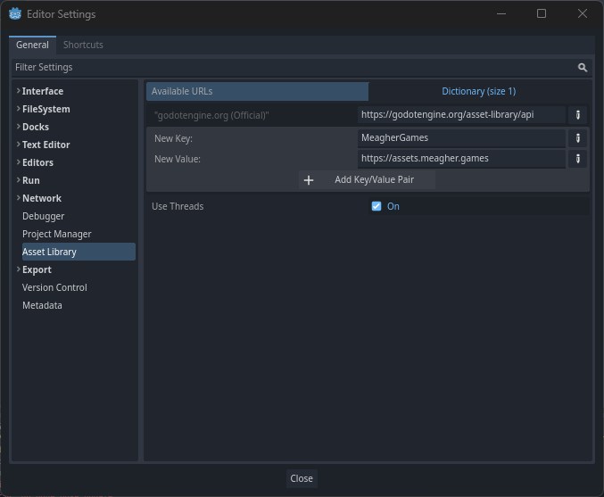

# Addons
MeagherGames addons for Godot Engine
Pushing changes to the main branch will automatically create a new release.
This is used by the [asset-library](https://github.com/MeagherGames/asset-library) to present the addons in the Godot Engine editor.

## Pre-requisites
- [Node.js](https://nodejs.org/en/download/)
- Add `https://assets.meagher.games` to your editor settings under `Editor > Editor Settings > Asset Library > Available URLs`  
  

## Install dependencies
```bash
npm install
```

## Create a new addon
```bash
npm run create
```
When creating an addon, the root directory of that addon is like the root directory of the Godot Engine project it'll be used in. So if you want anything in a folder say `addons/MyAddon` you'll need to create that folder structure yourself.


## Build
```bash
npm run build
```
This will create a `build` folder that will be used in the release.